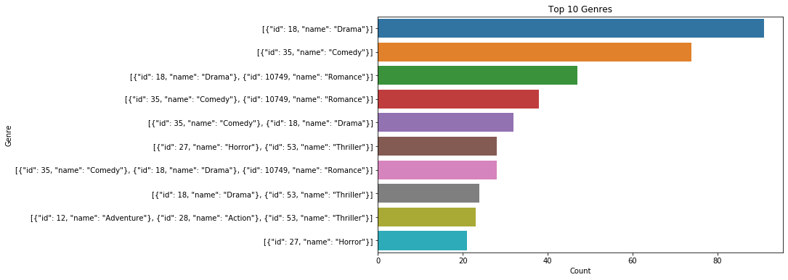
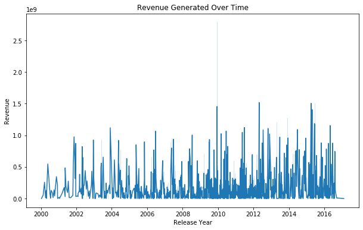
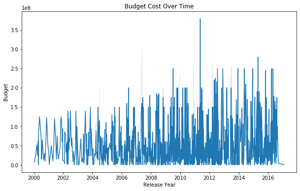
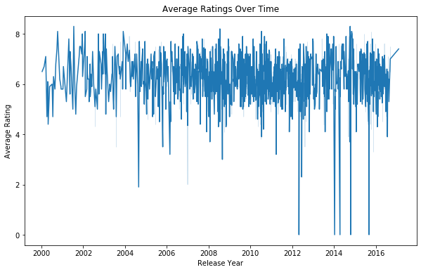
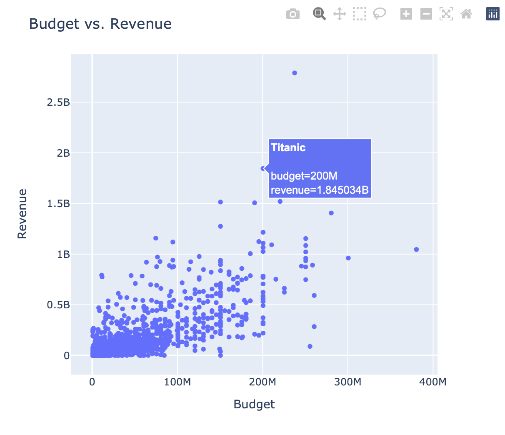
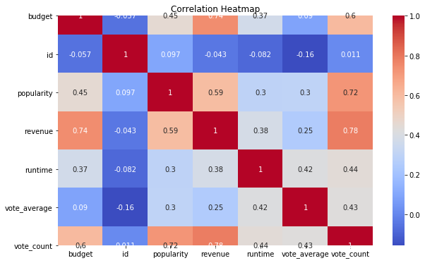

# Exploring Movie Data Insights

For this project, I delved into a comprehensive dataset containing information on 5000 movies. The dataset encompasses a wide array of attributes including budget, genres, release dates, revenue, and more. Through rigorous analysis and visualization, I aimed to uncover intriguing insights into the world of cinema.

### Jupyter Notebook Setup:

In this project, I utilized Python within a Jupyter Notebook environment. I harnessed the power of pandas for data manipulation, matplotlib and seaborn for visualization, and even integrated Plotly for enhanced interactive visualizations.


```python
import pandas as pd
import matplotlib.pyplot as plt
import seaborn as sns
import plotly.express as px
from datetime import datetime, date, timedelta
```

### Data Acquisition

The dataset, comprising 5000 movie entries, was sourced from tmdb.org, a comprehensive movie database and structured with columns encompassing diverse attributes such as budget, genres, homepage URLs, keywords, original titles, and more. This rich dataset served as the foundation for our exploration.


```python
# Load the dataset
df = pd.read_csv('./tmdb_5000_movies.csv')

# Quick look at the data
df.head()
```


<div>

<table border="1" class="dataframe">
  <thead>
    <tr style="text-align: right;">
      <th></th>
      <th>budget</th>
      <th>genres</th>
      <th>homepage</th>
      <th>id</th>
      <th>keywords</th>
      <th>original_language</th>
      <th>original_title</th>
      <th>overview</th>
      <th>popularity</th>
      <th>production_companies</th>
      <th>production_countries</th>
      <th>release_date</th>
      <th>revenue</th>
      <th>runtime</th>
      <th>spoken_languages</th>
      <th>status</th>
      <th>tagline</th>
      <th>title</th>
      <th>vote_average</th>
      <th>vote_count</th>
    </tr>
  </thead>
  <tbody>
    <tr>
      <td>0</td>
      <td>237000000</td>
      <td>[{"id": 28, "name": "Action"}, {"id": 12, "nam...</td>
      <td>http://www.avatarmovie.com/</td>
      <td>19995</td>
      <td>[{"id": 1463, "name": "culture clash"}, {"id":...</td>
      <td>en</td>
      <td>Avatar</td>
      <td>In the 22nd century, a paraplegic Marine is di...</td>
      <td>150.437577</td>
      <td>[{"name": "Ingenious Film Partners", "id": 289...</td>
      <td>[{"iso_3166_1": "US", "name": "United States o...</td>
      <td>2009-12-10</td>
      <td>2787965087</td>
      <td>162.0</td>
      <td>[{"iso_639_1": "en", "name": "English"}, {"iso...</td>
      <td>Released</td>
      <td>Enter the World of Pandora.</td>
      <td>Avatar</td>
      <td>7.2</td>
      <td>11800</td>
    </tr>
    <tr>
      <td>1</td>
      <td>300000000</td>
      <td>[{"id": 12, "name": "Adventure"}, {"id": 14, "...</td>
      <td>http://disney.go.com/disneypictures/pirates/</td>
      <td>285</td>
      <td>[{"id": 270, "name": "ocean"}, {"id": 726, "na...</td>
      <td>en</td>
      <td>Pirates of the Caribbean: At World's End</td>
      <td>Captain Barbossa, long believed to be dead, ha...</td>
      <td>139.082615</td>
      <td>[{"name": "Walt Disney Pictures", "id": 2}, {"...</td>
      <td>[{"iso_3166_1": "US", "name": "United States o...</td>
      <td>2007-05-19</td>
      <td>961000000</td>
      <td>169.0</td>
      <td>[{"iso_639_1": "en", "name": "English"}]</td>
      <td>Released</td>
      <td>At the end of the world, the adventure begins.</td>
      <td>Pirates of the Caribbean: At World's End</td>
      <td>6.9</td>
      <td>4500</td>
    </tr>
    <tr>
      <td>2</td>
      <td>245000000</td>
      <td>[{"id": 28, "name": "Action"}, {"id": 12, "nam...</td>
      <td>http://www.sonypictures.com/movies/spectre/</td>
      <td>206647</td>
      <td>[{"id": 470, "name": "spy"}, {"id": 818, "name...</td>
      <td>en</td>
      <td>Spectre</td>
      <td>A cryptic message from Bond’s past sends him o...</td>
      <td>107.376788</td>
      <td>[{"name": "Columbia Pictures", "id": 5}, {"nam...</td>
      <td>[{"iso_3166_1": "GB", "name": "United Kingdom"...</td>
      <td>2015-10-26</td>
      <td>880674609</td>
      <td>148.0</td>
      <td>[{"iso_639_1": "fr", "name": "Fran\u00e7ais"},...</td>
      <td>Released</td>
      <td>A Plan No One Escapes</td>
      <td>Spectre</td>
      <td>6.3</td>
      <td>4466</td>
    </tr>
    <tr>
      <td>3</td>
      <td>250000000</td>
      <td>[{"id": 28, "name": "Action"}, {"id": 80, "nam...</td>
      <td>http://www.thedarkknightrises.com/</td>
      <td>49026</td>
      <td>[{"id": 849, "name": "dc comics"}, {"id": 853,...</td>
      <td>en</td>
      <td>The Dark Knight Rises</td>
      <td>Following the death of District Attorney Harve...</td>
      <td>112.312950</td>
      <td>[{"name": "Legendary Pictures", "id": 923}, {"...</td>
      <td>[{"iso_3166_1": "US", "name": "United States o...</td>
      <td>2012-07-16</td>
      <td>1084939099</td>
      <td>165.0</td>
      <td>[{"iso_639_1": "en", "name": "English"}]</td>
      <td>Released</td>
      <td>The Legend Ends</td>
      <td>The Dark Knight Rises</td>
      <td>7.6</td>
      <td>9106</td>
    </tr>
    <tr>
      <td>4</td>
      <td>260000000</td>
      <td>[{"id": 28, "name": "Action"}, {"id": 12, "nam...</td>
      <td>http://movies.disney.com/john-carter</td>
      <td>49529</td>
      <td>[{"id": 818, "name": "based on novel"}, {"id":...</td>
      <td>en</td>
      <td>John Carter</td>
      <td>John Carter is a war-weary, former military ca...</td>
      <td>43.926995</td>
      <td>[{"name": "Walt Disney Pictures", "id": 2}]</td>
      <td>[{"iso_3166_1": "US", "name": "United States o...</td>
      <td>2012-03-07</td>
      <td>284139100</td>
      <td>132.0</td>
      <td>[{"iso_639_1": "en", "name": "English"}]</td>
      <td>Released</td>
      <td>Lost in our world, found in another.</td>
      <td>John Carter</td>
      <td>6.1</td>
      <td>2124</td>
    </tr>
  </tbody>
</table>
</div>


### Data Exploration

Upon loading the dataset, I immediately examined its structure. With 5000 entries and 20 columns, it provided a robust foundation for analysis. I further delved into the details of each column, gaining insights into data types and potential trends.


```python
# Get an overview of the dataset
df.info()

# Statistical summary of numerical columns
df.describe()
```

    <class 'pandas.core.frame.DataFrame'>
    RangeIndex: 4803 entries, 0 to 4802
    Data columns (total 20 columns):
    budget                  4803 non-null int64
    genres                  4803 non-null object
    homepage                1712 non-null object
    id                      4803 non-null int64
    keywords                4803 non-null object
    original_language       4803 non-null object
    original_title          4803 non-null object
    overview                4800 non-null object
    popularity              4803 non-null float64
    production_companies    4803 non-null object
    production_countries    4803 non-null object
    release_date            4802 non-null object
    revenue                 4803 non-null int64
    runtime                 4801 non-null float64
    spoken_languages        4803 non-null object
    status                  4803 non-null object
    tagline                 3959 non-null object
    title                   4803 non-null object
    vote_average            4803 non-null float64
    vote_count              4803 non-null int64
    dtypes: float64(3), int64(4), object(13)
    memory usage: 750.6+ KB


<div>

<table border="1" class="dataframe">
  <thead>
    <tr style="text-align: right;">
      <th></th>
      <th>budget</th>
      <th>id</th>
      <th>popularity</th>
      <th>revenue</th>
      <th>runtime</th>
      <th>vote_average</th>
      <th>vote_count</th>
    </tr>
  </thead>
  <tbody>
    <tr>
      <td>count</td>
      <td>4.803000e+03</td>
      <td>4803.000000</td>
      <td>4803.000000</td>
      <td>4.803000e+03</td>
      <td>4801.000000</td>
      <td>4803.000000</td>
      <td>4803.000000</td>
    </tr>
    <tr>
      <td>mean</td>
      <td>2.904504e+07</td>
      <td>57165.484281</td>
      <td>21.492301</td>
      <td>8.226064e+07</td>
      <td>106.875859</td>
      <td>6.092172</td>
      <td>690.217989</td>
    </tr>
    <tr>
      <td>std</td>
      <td>4.072239e+07</td>
      <td>88694.614033</td>
      <td>31.816650</td>
      <td>1.628571e+08</td>
      <td>22.611935</td>
      <td>1.194612</td>
      <td>1234.585891</td>
    </tr>
    <tr>
      <td>min</td>
      <td>0.000000e+00</td>
      <td>5.000000</td>
      <td>0.000000</td>
      <td>0.000000e+00</td>
      <td>0.000000</td>
      <td>0.000000</td>
      <td>0.000000</td>
    </tr>
    <tr>
      <td>25%</td>
      <td>7.900000e+05</td>
      <td>9014.500000</td>
      <td>4.668070</td>
      <td>0.000000e+00</td>
      <td>94.000000</td>
      <td>5.600000</td>
      <td>54.000000</td>
    </tr>
    <tr>
      <td>50%</td>
      <td>1.500000e+07</td>
      <td>14629.000000</td>
      <td>12.921594</td>
      <td>1.917000e+07</td>
      <td>103.000000</td>
      <td>6.200000</td>
      <td>235.000000</td>
    </tr>
    <tr>
      <td>75%</td>
      <td>4.000000e+07</td>
      <td>58610.500000</td>
      <td>28.313505</td>
      <td>9.291719e+07</td>
      <td>118.000000</td>
      <td>6.800000</td>
      <td>737.000000</td>
    </tr>
    <tr>
      <td>max</td>
      <td>3.800000e+08</td>
      <td>459488.000000</td>
      <td>875.581305</td>
      <td>2.787965e+09</td>
      <td>338.000000</td>
      <td>10.000000</td>
      <td>13752.000000</td>
    </tr>
  </tbody>
</table>
</div>


### Data Cleaning

Given the size of the dataset, ensuring consistency in data formats and was free of missing values or duplicates was imperative. This was crucial to prepare the data for meaningful analysis.

To identify and address any potential missing values, I used the df.isna().sum() function. In this case, there were some missing values, so I applied an appropriate strategy of dropping the rows with missing data and any potential duplicates.


```python
# Shows missing values per column
df.isna().sum()
```


    budget                     0
    genres                     0
    homepage                3091
    id                         0
    keywords                   0
    original_language          0
    original_title             0
    overview                   3
    popularity                 0
    production_companies       0
    production_countries       0
    release_date               1
    revenue                    0
    runtime                    2
    spoken_languages           0
    status                     0
    tagline                  844
    title                      0
    vote_average               0
    vote_count                 0
    dtype: int64


```python
# Handling missing values
df.dropna(inplace=True)
```

To ensure data integrity, I attempted to identify and remove duplicates using df.duplicated().sum(). Any duplicates found were removed using df.drop_duplicates(inplace=True)


```python
df.duplicated().sum()  # Shows the number of duplicates
```


    0


```python
# Removing duplicates
df.drop_duplicates(inplace=True)
```

### Data Visualization
I harnessed the power of matplotlib and seaborn to create an array of visualizations. These ranged from bar charts depicting genre distributions to line plots tracking revenue trends over time. The visualizations served as a pivotal means to convey insights effectively.


```python
# Bar chart of genre distribution
plt.figure(figsize=(10, 6))
sns.countplot(y='genres', data=df, order=df['genres'].value_counts().index[:10])
plt.title('Top 10 Genres')
plt.xlabel('Count')
plt.ylabel('Genre')
plt.show()
```





#### Budgets, Revenue and Ratings Over Time:

I created line charts using plt.plot() to visualize the trends of budget costs, revenue generated and average movie ratings over the years. These charts provides a clear visual representation of how each have evolved.

In order to more easily work with the dates contained within the dataset, I converted each value in the release_date row from a string to a datetime object. I then sorted the dataset in ascending order.


```python
df['release_date'] = pd.to_datetime(df['release_date'], format = '%Y-%m-%d')
```


```python
df_sorted = df.sort_values(by='release_date', ascending=True)
df_sorted.head()
```


<div>

<table border="1" class="dataframe">
  <thead>
    <tr style="text-align: right;">
      <th></th>
      <th>budget</th>
      <th>genres</th>
      <th>homepage</th>
      <th>id</th>
      <th>keywords</th>
      <th>original_language</th>
      <th>original_title</th>
      <th>overview</th>
      <th>popularity</th>
      <th>production_companies</th>
      <th>production_countries</th>
      <th>release_date</th>
      <th>revenue</th>
      <th>runtime</th>
      <th>spoken_languages</th>
      <th>status</th>
      <th>tagline</th>
      <th>title</th>
      <th>vote_average</th>
      <th>vote_count</th>
    </tr>
  </thead>
  <tbody>
    <tr>
      <td>4259</td>
      <td>1488423</td>
      <td>[{"id": 14, "name": "Fantasy"}, {"id": 16, "na...</td>
      <td>http://movies.disney.com/snow-white-and-the-se...</td>
      <td>408</td>
      <td>[{"id": 351, "name": "poison"}, {"id": 616, "n...</td>
      <td>en</td>
      <td>Snow White and the Seven Dwarfs</td>
      <td>A beautiful girl, Snow White, takes refuge in ...</td>
      <td>80.171283</td>
      <td>[{"name": "Walt Disney Productions", "id": 3166}]</td>
      <td>[{"iso_3166_1": "US", "name": "United States o...</td>
      <td>1937-12-20</td>
      <td>184925486</td>
      <td>83.0</td>
      <td>[{"iso_639_1": "en", "name": "English"}]</td>
      <td>Released</td>
      <td>The Happiest, Dopiest, Grumpiest, Sneeziest mo...</td>
      <td>Snow White and the Seven Dwarfs</td>
      <td>6.9</td>
      <td>1914</td>
    </tr>
    <tr>
      <td>3986</td>
      <td>2777000</td>
      <td>[{"id": 12, "name": "Adventure"}, {"id": 10751...</td>
      <td>http://thewizardofoz.warnerbros.com/</td>
      <td>630</td>
      <td>[{"id": 616, "name": "witch"}, {"id": 704, "na...</td>
      <td>en</td>
      <td>The Wizard of Oz</td>
      <td>Young Dorothy finds herself in a magical world...</td>
      <td>67.417542</td>
      <td>[{"name": "Loew's Incorporated", "id": 31892}]</td>
      <td>[{"iso_3166_1": "US", "name": "United States o...</td>
      <td>1939-08-15</td>
      <td>33754967</td>
      <td>102.0</td>
      <td>[{"iso_639_1": "en", "name": "English"}]</td>
      <td>Released</td>
      <td>We're off to see the Wizard, the wonderful Wiz...</td>
      <td>The Wizard of Oz</td>
      <td>7.4</td>
      <td>1642</td>
    </tr>
    <tr>
      <td>4050</td>
      <td>2280000</td>
      <td>[{"id": 16, "name": "Animation"}, {"id": 10751...</td>
      <td>http://movies.disney.com/fantasia</td>
      <td>756</td>
      <td>[{"id": 3537, "name": "orchestra"}, {"id": 578...</td>
      <td>en</td>
      <td>Fantasia</td>
      <td>Walt Disney's timeless masterpiece is an extra...</td>
      <td>32.875469</td>
      <td>[{"name": "Walt Disney Pictures", "id": 2}]</td>
      <td>[{"iso_3166_1": "US", "name": "United States o...</td>
      <td>1940-11-13</td>
      <td>83320000</td>
      <td>124.0</td>
      <td>[{"iso_639_1": "en", "name": "English"}]</td>
      <td>Released</td>
      <td>The most sensational sound you'll ever see!</td>
      <td>Fantasia</td>
      <td>7.2</td>
      <td>808</td>
    </tr>
    <tr>
      <td>4441</td>
      <td>858000</td>
      <td>[{"id": 16, "name": "Animation"}, {"id": 18, "...</td>
      <td>http://movies.disney.com/bambi</td>
      <td>3170</td>
      <td>[{"id": 5774, "name": "forest"}, {"id": 10683,...</td>
      <td>en</td>
      <td>Bambi</td>
      <td>Bambi's tale unfolds from season to season as ...</td>
      <td>47.651878</td>
      <td>[{"name": "Walt Disney Productions", "id": 3166}]</td>
      <td>[{"iso_3166_1": "US", "name": "United States o...</td>
      <td>1942-08-14</td>
      <td>267447150</td>
      <td>70.0</td>
      <td>[{"iso_639_1": "en", "name": "English"}]</td>
      <td>Released</td>
      <td>A great love story.</td>
      <td>Bambi</td>
      <td>6.8</td>
      <td>1405</td>
    </tr>
    <tr>
      <td>4339</td>
      <td>950000</td>
      <td>[{"id": 12, "name": "Adventure"}, {"id": 28, "...</td>
      <td>http://www.mgm.com/#/our-titles/566/Dr.-No</td>
      <td>646</td>
      <td>[{"id": 212, "name": "london england"}, {"id":...</td>
      <td>en</td>
      <td>Dr. No</td>
      <td>In the film that launched the James Bond saga,...</td>
      <td>48.901542</td>
      <td>[{"name": "United Artists", "id": 60}, {"name"...</td>
      <td>[{"iso_3166_1": "JM", "name": "Jamaica"}, {"is...</td>
      <td>1962-10-04</td>
      <td>59600000</td>
      <td>110.0</td>
      <td>[{"iso_639_1": "en", "name": "English"}, {"iso...</td>
      <td>Released</td>
      <td>NOW meet the most extraordinary gentleman spy ...</td>
      <td>Dr. No</td>
      <td>6.9</td>
      <td>940</td>
    </tr>
  </tbody>
</table>
</div>


I then chose to make a cutoff of January 1, 2000 to only include modern titles.


```python
start_year = df_sorted['release_date'] >= datetime(2000, 1, 1)
df_2000s_present = df_sorted[start_year]
df_2000s_present.head()
```


<div>

<table border="1" class="dataframe">
  <thead>
    <tr style="text-align: right;">
      <th></th>
      <th>budget</th>
      <th>genres</th>
      <th>homepage</th>
      <th>id</th>
      <th>keywords</th>
      <th>original_language</th>
      <th>original_title</th>
      <th>overview</th>
      <th>popularity</th>
      <th>production_companies</th>
      <th>production_countries</th>
      <th>release_date</th>
      <th>revenue</th>
      <th>runtime</th>
      <th>spoken_languages</th>
      <th>status</th>
      <th>tagline</th>
      <th>title</th>
      <th>vote_average</th>
      <th>vote_count</th>
    </tr>
  </thead>
  <tbody>
    <tr>
      <td>3344</td>
      <td>7000000</td>
      <td>[{"id": 35, "name": "Comedy"}, {"id": 18, "nam...</td>
      <td>http://mydogskip.warnerbros.com/</td>
      <td>17908</td>
      <td>[{"id": 787, "name": "mississippi"}, {"id": 33...</td>
      <td>en</td>
      <td>My Dog Skip</td>
      <td>A shy boy is unable to make friends in Yazoo C...</td>
      <td>5.675535</td>
      <td>[{"name": "Alcon Entertainment", "id": 1088}, ...</td>
      <td>[{"iso_3166_1": "US", "name": "United States o...</td>
      <td>2000-01-14</td>
      <td>0</td>
      <td>95.0</td>
      <td>[{"iso_639_1": "en", "name": "English"}]</td>
      <td>Released</td>
      <td>Every family needs an optimist.</td>
      <td>My Dog Skip</td>
      <td>6.5</td>
      <td>69</td>
    </tr>
    <tr>
      <td>1995</td>
      <td>23000000</td>
      <td>[{"id": 53, "name": "Thriller"}, {"id": 878, "...</td>
      <td>http://www.pitchblack.com/</td>
      <td>2787</td>
      <td>[{"id": 3762, "name": "darkness"}, {"id": 4565...</td>
      <td>en</td>
      <td>Pitch Black</td>
      <td>When their ship crash-lands on a remote planet...</td>
      <td>18.493202</td>
      <td>[{"name": "Interscope Communications", "id": 1...</td>
      <td>[{"iso_3166_1": "US", "name": "United States o...</td>
      <td>2000-02-18</td>
      <td>53187659</td>
      <td>108.0</td>
      <td>[{"iso_639_1": "en", "name": "English"}]</td>
      <td>Released</td>
      <td>Don't be afraid of the dark. Be afraid of what...</td>
      <td>Pitch Black</td>
      <td>6.7</td>
      <td>1789</td>
    </tr>
    <tr>
      <td>909</td>
      <td>52000000</td>
      <td>[{"id": 18, "name": "Drama"}]</td>
      <td>http://www.brockovich.com/movie.html</td>
      <td>462</td>
      <td>[{"id": 5565, "name": "biography"}, {"id": 967...</td>
      <td>en</td>
      <td>Erin Brockovich</td>
      <td>A twice-divorced mother of three who sees an i...</td>
      <td>30.347332</td>
      <td>[{"name": "Jersey Films", "id": 216}]</td>
      <td>[{"iso_3166_1": "US", "name": "United States o...</td>
      <td>2000-03-17</td>
      <td>256271286</td>
      <td>131.0</td>
      <td>[{"iso_639_1": "en", "name": "English"}, {"iso...</td>
      <td>Released</td>
      <td>She brought a small town to its feet and a hug...</td>
      <td>Erin Brockovich</td>
      <td>7.1</td>
      <td>716</td>
    </tr>
    <tr>
      <td>1978</td>
      <td>24000000</td>
      <td>[{"id": 28, "name": "Action"}, {"id": 35, "nam...</td>
      <td>http://readytorumble.warnerbros.com/flash.html</td>
      <td>20697</td>
      <td>[{"id": 5970, "name": "wrestling"}, {"id": 607...</td>
      <td>en</td>
      <td>Ready to Rumble</td>
      <td>Two slacker wrestling fans are devastated by t...</td>
      <td>3.113009</td>
      <td>[{"name": "Bel Air Entertainment", "id": 788},...</td>
      <td>[{"iso_3166_1": "US", "name": "United States o...</td>
      <td>2000-04-07</td>
      <td>12372410</td>
      <td>107.0</td>
      <td>[{"iso_639_1": "en", "name": "English"}]</td>
      <td>Released</td>
      <td>They're headed to the big time...face first.</td>
      <td>Ready to Rumble</td>
      <td>4.7</td>
      <td>49</td>
    </tr>
    <tr>
      <td>680</td>
      <td>62000000</td>
      <td>[{"id": 28, "name": "Action"}, {"id": 18, "nam...</td>
      <td>http://www.u-571.com/</td>
      <td>3536</td>
      <td>[{"id": 339, "name": "submarine"}, {"id": 1956...</td>
      <td>en</td>
      <td>U-571</td>
      <td>In the midst of World War II, the battle under...</td>
      <td>18.096884</td>
      <td>[{"name": "Universal Pictures", "id": 33}, {"n...</td>
      <td>[{"iso_3166_1": "FR", "name": "France"}, {"iso...</td>
      <td>2000-04-20</td>
      <td>127666415</td>
      <td>116.0</td>
      <td>[{"iso_639_1": "en", "name": "English"}, {"iso...</td>
      <td>Released</td>
      <td>Heroes are ordinary men who do extraordinary t...</td>
      <td>U-571</td>
      <td>6.1</td>
      <td>340</td>
    </tr>
  </tbody>
</table>
</div>


```python
plt.figure(figsize=(10, 6))
sns.lineplot(x='release_date', y='revenue', data=df_2000s_present)
plt.xlabel('Release Year')
plt.ylabel('Revenue')
plt.title('Revenue Generated Over Time')
plt.plot()
plt.show()
```

    /opt/anaconda3/lib/python3.7/site-packages/pandas/plotting/_matplotlib/converter.py:103: FutureWarning: Using an implicitly registered datetime converter for a matplotlib plotting method. The converter was registered by pandas on import. Future versions of pandas will require you to explicitly register matplotlib converters.
    
    To register the converters:
    	>>> from pandas.plotting import register_matplotlib_converters
    	>>> register_matplotlib_converters()
      warnings.warn(msg, FutureWarning)





```python
plt.figure(figsize=(10, 6))
sns.lineplot(x='release_date', y='budget', data=df_2000s_present)
plt.xlabel('Release Year')
plt.ylabel('Budget')
plt.title('Budget Cost Over Time')
plt.plot()
plt.show()
```





```python
plt.figure(figsize=(10, 6))
sns.lineplot(x='release_date', y='revenue', data=df_2000s_present)
plt.xlabel('Release Year')
plt.ylabel('Revenue')
plt.title('Revenue Generated Over Time')
plt.plot()
plt.show()
```


```python
plt.figure(figsize=(10, 6))
sns.lineplot(x='release_date', y='vote_average', data=df_2000s_present)
plt.xlabel('Release Year')
plt.ylabel('Average Rating')
plt.title('Average Ratings Over Time')
plt.plot()
plt.show()
```





The line charts illustrate that while budgets and revenue have increased over the years, there has been consistency in average ratings from the 2000s to the present.

## Interactive Visualization
For interactive visualizations, I integrated Plotly. This library offers dynamic charts that allow for user-driven exploration of the data.


```python
fig = px.scatter(df, x='budget', y='revenue', hover_name='original_title')
fig.update_layout(title='Budget vs. Revenue', xaxis_title='Budget', yaxis_title='Revenue')
fig.show()
```





The correlation heatmap visually illustrates correlations between attributes, with a focus on the 'budget' column. Warmer colors indicate positive correlations, while cooler colors indicate negative ones. This visualization helps identify attributes strongly linked to budget, providing valuable insights.


```python
# Correlation heatmap
correlation_matrix = df.corr()
plt.figure(figsize=(10, 6))
sns.heatmap(correlation_matrix, annot=True, cmap='coolwarm')
plt.title('Correlation Heatmap')
plt.show()
```





## Summary Statistics:

I calculated summary statistics to gain insights into the central tendencies and variability of the ratings, budgets, and revenues. This included the mean, median, and standard deviation of all three.


```python
mean_rating = df['vote_average'].mean()
median_rating = df['vote_average'].median()
std_dev_rating = df['vote_average'].std()
print("Mean Rating: ", mean_rating)
print("Median Rating: ", median_rating)
print("Standard Deviation of Average Ratings: ", std_dev_rating)
```

    Mean Rating:  6.2728734092431315
    Median Rating:  6.3
    Standard Deviation of Average Ratings:  0.9704796128740953


```python
mean_budget = df["budget"].mean()
median_budget = df["budget"].median()
std_dev_budget = df["budget"].std()
print("Mean Budget:", mean_budget)
print("Median Budget:", median_budget)
print("Standard Devation of Budgets:", std_dev_budget)
```

    Mean Budget: 45895338.38981915
    Median Budget: 27000000.0
    Standard Devation of Budgets: 53692188.6109503


```python
mean_revenuee = df["revenue"].mean()
median_revenue = df["revenue"].median()
std_dev_revenue = df["revenue"].std()
print("Mean Revenue:", mean_budget)
print("Median Revenue:", median_budget)
print("Standard Devation of Revenues:", std_dev_budget)
```

    Mean Revenue: 45895338.38981915
    Median Revenue: 27000000.0
    Standard Devation of Revenues: 53692188.6109503


## Conclusion:

This project provided a profound exploration of movie data, uncovering valuable insights into various facets of the film industry. From budgeting trends to genre popularity, the analysis shed light on patterns that can inform future cinematic endeavors.